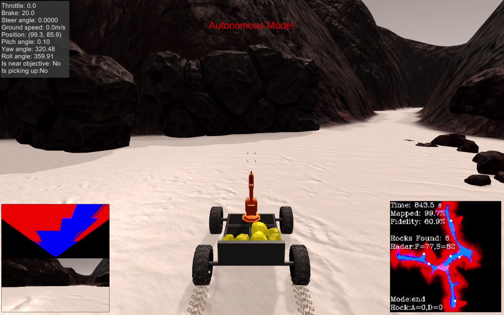
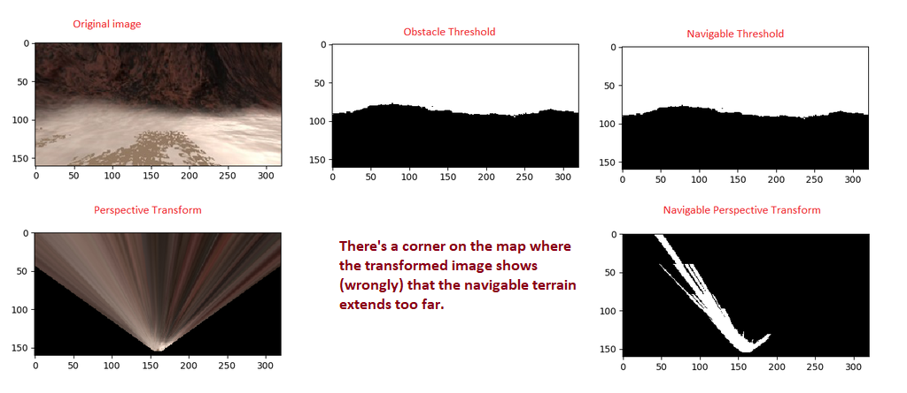

# Project: Search and Sample Return
---

## Table of contents

**1. Project folder structure** <br>
**2. Notebook Analysis** <br>
**3. Autonomous Navigation and Mapping** <br>
**4. Scope for Improvement** <br>
**5. Possible failures** <br>

---
## 1. Project folder structure

**1.1 Source code** : ./code <br>
    1. constants.py : Contains all the tuning parameters <br>
    2. decision.py : Contains the autonomous mapping algorithm <br>
    3. drive_rover.py : Defines rover state and contains necessary functions to drive the rover <br>
    4. perception.py : Processes sensor data <br>
    5. supporting_functions.py : Miscellaneous functions <br>

**1.2 Notebooks** : ./code <br>
    1. Rover_Project_Test_Notebook.ipynb : Filled up notebook with tests for training data & video creation <br>
    2. Thresholding_Tool.ipynb : A custom tool with GUI components to help threshold the different vision image parts <br>
    3. HSV_Test.ipynb : a test for HSV color space <br>
    
**1.3 Output** : ./output <br>
    1. test_mapping.mp4 : Video generated using the given training data <br>
    2. test_mapping_recorded.mp4 : Video generated using recorded data <br>
    3. autonomous_mode_recorded.mp4 : Video of the autonomous run (sped up by 10x) <br>
  
**1.4 Test Dataset Paths** :  <br>
    1. ./test_dataset : the given test data-set <br>
    2. ./test_dataset_recorded : the custom recorded data-set <br>
    
**1.5 Calibration Images** : ./new_calib <br>

---
## 2. Notebook Analysis

[//]: # (Image References)
[image1]: ./writeup_images/threshold_tool_screenshot.png
[image2]: ./calibration_images/example_grid1.jpg
[image3]: ./calibration_images/example_rock1.jpg 


### Color Thresholding : 
For color thresholding, the color_thresh() method was modified to use both a lower bound and an upper bound threshold.
This code is present in : ./code/perception.py (and also in the jupyter notebook).

```python
def color_thresh(img, rgb_thresh_min, rgb_thresh_max):
    color_select = np.zeros_like(img[:,:,0])
    # Threshold with upper and lower bound
    mask = (img[:,:,0] >= rgb_thresh_min[0]) & (img[:,:,1] >= rgb_thresh_min[1]) & (img[:,:,2] >= rgb_thresh_min[2]) \
       & (img[:,:,0] <= rgb_thresh_max[0]) & (img[:,:,1] <= rgb_thresh_max[1]) & (img[:,:,2] <= rgb_thresh_max[2])
    color_select[mask] = 1
    return color_select
```

However, a major problem was setting the actual values for the different variations in obstacle, rock, shadows, etc. I tried the following two approaches :

**1. Using HSV color space using OpenCV2.**
In a separate notebook (./code/HSV_Test.ipynb), HSV color space was experimented.

```python
hsv_image = cv2.cvtColor(test_image, cv2.COLOR_RGB2HSV_FULL)
```
However, this didn't make much of a difference and I still faced the same issues differentiating some tricky parts (e.g. the rock and the skid marks of the wheels). So I went back to using the RGB color space.

**2. Creating a dedicated RGB thresholding tool using GUI sliders in python**

This greatly helped me fine tune the threshold and achieve a high degree of accuracy. This tool was written in a Jupyter notebook and the path is : ./code/Thresholding_Tool.ipynb

Screenshot of this tool (note the GUI sliders at the bottom) : 
![Thresholding tool created using python][image1]


### Obstacle detection : 

For obstacle detection, first of all, the thresholds were set using the above tool that I wrote. After that, the following method was used : 

```python
def obstacle_thresh(img, clip_top_ratio = 0.45, rgb_thresh_min=(0, 0, 0), rgb_thresh_max=(118,103,120)):
    obs_th_img = color_thresh(img, rgb_thresh_min, rgb_thresh_max)
    top_half = int(clip_top_ratio * img.shape[0])
    obs_th_img[:top_half,:] = 1 # above the horizon its always an obstacle
    return obs_th_img
```

This method is defined in ./code/perception.py

Firstly, a basic threshold is done on the image to identify the 'walls' / 'hills'.

Secondly, a key approximation has been used : Since the terrain is relatively flat, the sky covers the top part of the image. This sky is added to the 'obstacle' part of the image. In the above example, the top 45% of the image is considered an obstacle (its above the horizon). The rest part of the image that is within the threshold defined, also forms the obstacle.


### Rock samples detection :

For rock sample detection, the rock_thresh() method has been used and is defined in : ./code/perception.py

```python
def rock_thresh(img, rgb_thresh_min=(125,102,0), rgb_thresh_max=(204,185,78)):
    output = color_thresh(img, rgb_thresh_min, rgb_thresh_max)
    output = cv2.GaussianBlur(output, (3, 3), 0)
    return output
```
After thresholding the image, a gaussian blur has been applied. This (the gaussian blur) reduced noise and prevented stray pixels near the rover skid tracks from being detected as a rock.

### Navigable terrain detection : 

For navigable terrain detection, the approach is similar to the one described in the obstacle detection section.

This has been defined in navigable_thresh() method in ./code/perception.py


### Perspective Transform :

A key point of difference between what was shown in the course and what I've done is that - I've applied the perspective transform *after* doing the color threshold. Generally speaking, this shouldn't make a difference but for my approach of thresholding (clipping above/below the horizon, etc) this is an important step.

The perspective transform is defined using the method : perspect_transform() in ./code/perception.py

### The process_image() function :
This function is present in the jupyter notebook : ./code/Rover_Project_Test_Notebook.ipynb

**Step 1 : Color Thresholding & image processing** 
Color threshold (lower and upper bound) was applied to identify : 
(a) Navigable terrain 
(b) Obstacles
(c) Rock Samples

In addition, during the thresholding the following was also done : 
For (a) and (b) clipping of the images above / below the horizon was done as already explained.
For (c) Gaussian Blur was applied to remove noise.

**Step 2 : Perspective Transform** 
This step is done after thresholding (instead of before thresholding) as already explained.
The transform is calculated for each : navigable terrain, obstacles and rock samples
The constants for the transform (like source and destination) were calculated using notebook analysis of the recorded images.

**Step 3 : Mapping to world coordinates** 
Conversion to world-centric and rover-centric coordinates is done for each of the three :  navigable terrain, obstacles and rock samples.

**Step 4 : Update of the world map** 

If the rover pitch deviates too much from normal, then the mapping is skipped to improve fidelity.
e.g. :
```python
pitch_tolerance = 2
if data.pitch[data.count] <= pitch_tolerance or data.pitch[data.count] >= (360 - pitch_tolerance):
    # Map to coordinates
    top_half = int(0.4 * img.shape[0])
    clipped_navigable_trans_image = np.copy(warped_navigable)
    clipped_navigable_trans_image[:top_half,:] = 0 
    clipped_navigable_x_rover, clipped_navigable_y_rover = rover_coords(clipped_navigable_trans_image)
    clipped_navigable_x_world, clipped_navigable_y_world = pix_to_world(clipped_navigable_x_rover, clipped_navigable_y_rover, data.xpos[data.count], data.ypos[data.count], data.yaw[data.count], world_map_size, map_scale)
    data.worldmap[obstacle_y_world, obstacle_x_world, 0] += 1
    data.worldmap[rock_y_world, rock_x_world, 1] += 1
    data.worldmap[clipped_navigable_y_world, clipped_navigable_x_world, 2] += 1
```

While evaluating the navigable pixels to add to the world map, the top 40% is clipped off to improve accuracy / fidelity. These navigable pixels that are too far ahead introduce too much noise after being warped (perspective transform). Hence, these are removed before updating the world map.

**Step 5 : Cleanup nav / obstacles using probability and statistics** 
```python
if np.max(data.worldmap[:,:,2]) > 0:
    nav_pix = data.worldmap[:,:,2] > 0
    navigable = data.worldmap[:,:,2] * (255 / np.mean(data.worldmap[nav_pix, 2]))
else:
    navigable = data.worldmap[:,:,2]
if np.max(data.worldmap[:,:,0]) > 0:
    obs_pix = data.worldmap[:,:,0] > 0
    obstacle = data.worldmap[:,:,0] * (255 / np.mean(data.worldmap[obs_pix, 0]))
else:
    obstacle = data.worldmap[:,:,0]

likely_nav = navigable >= obstacle
obstacle[likely_nav] = 0
likely_obs = obstacle >= 3 * navigable
navigable[likely_obs] = 0
plotmap = np.zeros_like(data.worldmap)
plotmap[:, :, 0] = obstacle
plotmap[:, :, 2] = navigable
```
To further improve fidelity, some additional post-processing is done.

From the obstacle map, all likely navigable pixels are marked as 0. Similarly, likey obstacle pixels are marked as 0 in the navigable map. These 'likely obstacle pixels' are defined as being '3 times' more probable than navigable pixels.

**Step 6 : Fidelity calculation and display mosaic image** 
Using the cleaned up plotmap, fidelity is calculated and the mosaic images are drawn.


### Video output using training data : 
Video with the given data-set : 
**./output/test_mapping.mp4**

Video with the recorded data-set : 
**./output/test_mapping_recorded.mp4**

---
## 3. Autonomous Navigation and Mapping

### Brief summary of the autonomous algorithm
The robot is designed as a left-wall follower. It calculates the distance in front and left sides and tries to maintain a fixed distance from the left wall. If it encounters a wall in the front, it reverses (while steering left at the same time) to align itself with the wall and then rotates till it finds a clear path.

Initially, when the rover starts, it stores the starting position. It then rotates till it finds a clear path ahead, and moves towards a wall.

During traversing, if it encounters a rock on the left side, it rotates (aligns with the direction of the rock) and then moves towards it to pick it up. This is done only if the rock distance is less than the minimum defined (and its angle is on the left side).

Once it has mapped the world and returns near the starting point, it rotates towards the exact start point, and then moves towards it. Once it reaches the initial starting point, the algoritm ends.

Please check the video at : **./output/autonomous_mode_recorded.mp4** (video sped up by 10x).

**Simulator Resolution used :** `1680 x 1050` with a graphics quality of 'Fantastic' and FPS of 11.

### Tuning parameters
The tuning parameters used for the autonomous mode are defined in : ./code/constants.py

### 1. Explanation of `perception_step()`
In the perception_step() function, firstly, the color thresholds are applied, followed by perspective transform to find the navigable terrain, obstacles, and the rock samples. The required coordinates are converted from rover-centric to world-centric. The details of these steps are already explained above.

**Clip the top part of the navigable image :**
In order to improve fidelity, the topmost part of the thresholded & warped image is removed. This ensures that the pixels too far ahead of the rover do not mess up the accuracy of the navigable pixels. Code snippet is below : 
```python
top_half = int(constants.NAVIGALBE_TRANS_IMAGE_CLIP * img.shape[0])
clipped_navigable_trans_image = np.copy(navigable_trans_image)
clipped_navigable_trans_image[:top_half,:] = 0 
clipped_navigable_x_rover, clipped_navigable_y_rover = rover_coords(clipped_navigable_trans_image)
clipped_navigable_x_world, clipped_navigable_y_world = pix_to_world(clipped_navigable_x_rover, clipped_navigable_y_rover, Rover.pos[0], Rover.pos[1], Rover.yaw, world_map_size, map_scale)
    
```

**Ignore readings if pitch is out of range :**

An important step used here to improve fidelity is - 
```python
if not (Rover.pitch <= constants.PITCH_TOLERANCE or Rover.pitch >= (360 - constants.PITCH_TOLERANCE)):
    # pitch out of range, don't update the Rover
    return Rover
```
So basically, if the pitch of the rover is out of range (tolerance = 2), then the world map is not updated as the converted pixels are not accurate.

**Measurement of distances in front and left :**

Since this is a left wall hugger, the distance to the left and front sides is calculated.
```python
Rover.recon_distance = navigable_distance(Rover.nav_dists, Rover.nav_angles, 0)
Rover.front_wall_distance = obstacle_distance(Rover.obstacle_dists, Rover.obstacle_angles, 0)
Rover.wall_distance = obstacle_distance(Rover.obstacle_dists, Rover.obstacle_angles, constants.RANGE_FINDER_ANGLE)
```
Here, 
`recon_distance` is the clear distance in front of it (used in the starting mode of rotation, named as 'recon' mode).

`front_wall_distance` is the distance of the wall from front (if any).

`wall_distance` is the distance of the wall from the left side (RANGE_FINDER_ANGLE = 35 degrees).


**Measurement of distance and angle from starting position :**
```python
Rover.distance_from_start = distance.euclidean(Rover.pos, Rover.start_pos)
Rover.angle_to_start = angle_difference(Rover.pos, Rover.start_pos, Rover.yaw)
```
This helps to allow the rover to come back to its initial position once it has completed a round of the world map.

**Calculation of the distance and angle of the rock detected**
```python
Rover.rock_size = len(Rover.rock_dists)
if Rover.rock_size > 0:
    Rover.rock_dist = np.mean(Rover.rock_dists)
    Rover.rock_angle = np.mean(Rover.rock_angles * 180/np.pi)
    Rover.rock_pos = (np.mean(rock_x_world), np.mean(rock_y_world))
else:
    Rover.rock_dist = 0
    Rover.rock_angle = 0
    Rover.rock_pos = None
```
Whenever a rock is detected, the following are calculated : 

`rock_dist` = mean of the distance to the rock pixels from the rover's center

`rock_angle` = mean of the angle to the rock detected relative to rover

`rock_pos` = mean of the world position of the rock

**Removal of probable obstacles from the navigable map:**

As already explained, the pixels that are likely to be obstacles are removed from the navigable map to improve fidelity. This is present in the file : `supporting_funcations.py`

```python
if np.max(Rover.worldmap[:,:,2]) > 0:
    nav_pix = Rover.worldmap[:,:,2] > 0
    navigable = Rover.worldmap[:,:,2] * (255 / np.mean(Rover.worldmap[nav_pix, 2]))
else: 
    navigable = Rover.worldmap[:,:,2]
if np.max(Rover.worldmap[:,:,0]) > 0:
    obs_pix = Rover.worldmap[:,:,0] > 0
    obstacle = Rover.worldmap[:,:,0] * (255 / np.mean(Rover.worldmap[obs_pix, 0]))
else:
    obstacle = Rover.worldmap[:,:,0]

likely_nav = navigable >= obstacle
obstacle[likely_nav] = 0

# The probable obstacles are removed from navigable map
likely_obs = obstacle >= constants.OBSTACLE_PROBABILITY_FACTOR * navigable
navigable[likely_obs] = 0
```


### 2. Explanation of `decision_step()`

The brief summary written above gives a high level overview of the algorithm.

The algorithm is implemented in the form of various 'modes'. The rover is set to behave in particular modes based on a set of conditions (decision - tree).

**Note :** The tuning parameters used for the autonomous mode are defined in : ./code/constants.py

The following are the different modes : 

#### 1. Mode = `start`

The initial starting position of the Rover is stored and then the mode is set to `initial_recon`.

#### 2. Mode = `initial_recon`

At the beginning, the rover just rotates anti-clockwise and tries to find a clear path. If found, the mode is changed to `cruise`.

#### 3. Mode = `cruise`

The rover just tries to maintain a minimum distance with the left wall.

If a wall is encountered in the front, then the rover brakes and changes its mode to 'reverse'.

If any rock is sighted, decrease the speed and try to close the gap with the rock by following the wall till it comes close enough.


#### 4. Mode = `stop_and_turn`

The rover brakes and stops completetly. It then rotates clockwise till there is a clear path in front of it. If yes, it changes the mode back to 'cruise'.

#### 5. Behaviour when in vicinity of a rock : 

When a rock has been detected, in order for it to be picked up, the following conditions need to be met : 

1. The rock should be on the left side (`Rover.rock_angle > constants.ROCK_PICKUP_ANGLE_THRESHOLD`)

2. The rock should not be farther than the minimum distance defined

3. The rover is not already in the process of picking up a rock

If these conditions are met, then the mode is changed to 'rotate_before_pickup'. Also, the target position of the rock is now stored.

#### 6. Mode = `rotate_before_pickup` : 

This is the first mode in the sequence of modes for picking up a rock. Here, the rover aligns itself with the angle of the rock and if it is aligned, the mode is changed to `pickup`


#### 7. Mode = `pickup` : 

This is the second stage of the pickup process. In this mode, the rover moves and steers itself towards the rock. When it is near enough, it brakes and then sends the pickup signal. The mode is then changed to `wait_for_pickup_start`.

However, if no rock is detected anymore, the mode is changed back to `cruise`.

#### 8. Mode = `wait_for_pickup_start` :  

Since the pickup takes some time to start (because of the delay in sending the websocket request), in this mode, the rover keeps waiting till the pickup flag (Rover.picking_up) is still false. 

Once this flag is set to true, the mode is changed to 'wait_for_pickup_end'.


#### 9. Mode = `wait_for_pickup_end` :  

In this mode, the rover waits till the pickup is successful. If yes, then the mode is changed back to `cruise`.

#### 10. Mode = `stop_before_end` :  

If the rover is in the `cruise` mode and the Rover has completed mapping the world, and if the Rover is near its starting point, then the mode is set to this mode.

Here, Rover brakes to a stop. Upon completely stopping, the mode is changed to 'end'.

#### 11. Mode = `end` :  

Here, the Rover steers towards the starting position, and then starts to move towards it once it is aligned. When it has reached the starting position, it prints 'Completed the run'.


### 3. Results 

The rover maps the entire world, collects all 6 rocks and returns to the starting position.

The following is the result of an average run : 

**Time : 843.5 seconds** <br>
**Mapped : 99.7%** <br>
**Fidelity : 60.9%** <br>
**Rocks found : 6** <br>

Screenshot of the results : 



The video of the entire run (10x speed) is placed here : **./output/autonomous_mode_recorded.mp4**

**Simulator Resolution used :** `1680 x 1050` with a graphics quality of 'Fantastic' and FPS of 11.

---
## 4. Scope for Improvement

### 4.1 PID control : 
Instead of a fixed set of throttle and steering values, PID control may be used to more smoothly follow the wall. 

### 4.2 Speed' : 
It should be possible to increase the speed (and therefore the time taken to map the world) by quite a bit. The PID control mentioned above should also help. The max speed should be decreased gradually when obstacles are detected far in the front instead of abruptly braking when obstacles are right in front.

### 4.3 Rock detection : 
Rock detection can be improved further with some kind of 'blob' detection. This may help to eliminate false detections.

### 4.4 Path finding & obstacle avoidance : 
In the current algorithm, once the rover completes mapping the environment, and is near the starting point, it rotates towards this starting point and moves towards it. A much better alternative would be using a path finding algorithm with obstacle avoidance capabilities.

### 4.5 Better image processing techniques : 
Some advanced image processing techniques can be used to better detect obstacles & navigable terrain. For e.g. edge detection can be used to separate the wall from the navigable terrain.

### 4.6 Stereoscopic vision : 
A common problem was to accurately measure distances (especially to rocks). While using simple coordinate geometry with a single camera was sufficient for this project, a more accurate way to measure distances would be to use two separate cameras in front in the simulator itself.

### 4.7 Pitch and roll correction for sensor data : 
Instead of ignoring sensor data when pitch and roll is too high, the data could be adjusted to take into consideration the angles of pitch and roll.

---
## 5. Possible failures

### 5.1 'Hidden' rocks : 
In some rare cases, the rocks are hidden (especially at lower resolutions) where the rock is 'embedded' inside the ground and hardly any part of it is visible. Its next to impossible to even spot this with our own eyes, and is possibly a bug in the simulator.

### 5.2 Obstacles having same colour as the ground : 
In some parts of the map, where the obstacle (i.e. wall) has a slope and the ground is elevated, the region is light in color. This obstacle region is indistinguishable from the color of the ground (both in RGB and HSV color spaces). These elevated sloped regions results in incorrect perspective transform and the rover thinks there is a lot of navigable terrain when there isn't.

Example screenshot below :  <br>


